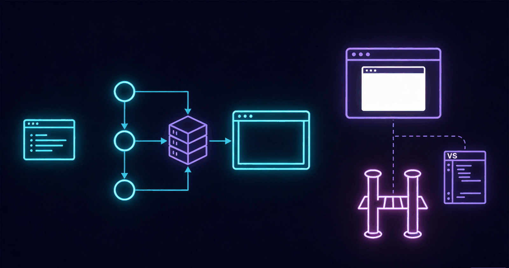

<div align="center">


# HarnessDock

**深潜工作台 —— DeepSeek Harness 的一键桌面停靠入口**

*薄壳客户端 · 原生加载官方 Web UI · 不 fork、不重写*

> **免责声明**：HarnessDock 为独立的第三方客户端，仅嵌入官方 DeepSeek Harness Web UI，与 DeepSeek 官方无隶属或背书关系；DeepSeek 及相关标识为 DeepSeek 官方商标。


</div>

HarnessDock 拉起官方 `dsh web` 并加载官方 Web UI，**Web 端全部操作**（模型、工作区、会话、审批、插件、导出）原样可用。不 fork 上游，不重写 SPA。

> 命名释义：**Dock** = 码头 / 停靠台 / 任务栏 Dock —— 官方 Harness 的一键停靠入口。
> 备选名（弃用存档）：HarnessDeck、DSH Console、NovaShell。

## 目录

- [特性一览](#特性一览)
- [架构](#架构)
- [一键构建（裸机可用）](#一键构建裸机可用)
- [独立运行 exe（Portable）](#独立运行-exeportable)
- [多种安装包](#多种安装包)
- [版本对齐](#版本对齐)
- [命令与环境变量](#命令与环境变量)

## 特性一览

- **薄壳零劫持**：嵌入官方 Web UI，功能 100% 原样，升级只需对齐版本号
- **双场景交付**：thin（小体积，首启拉取钉版 dsh）/ full（完全离线，内置 Node + dsh 运行时）
- **免安装运行**：Windows 双场景均产出单文件 Portable exe，U 盘即插即用
- **裸机一键构建**：无 Node / pnpm / dsh 的第三方电脑直接跑构建脚本，工具链自动引导
- **三端同构**：桌面 + VS Code / Cursor 扩展共用一套运行时代码

## 架构



`docs-sync` 钉版本 → `client-runtime` spawn `dsh web --host 127.0.0.1 --port 0 --no-open --patch` → `plugin-embedded-client` 写 ready 文件 → Electron / VS Code 加载官方 URL。

数据与凭证仍走官方 `~/.dsh/`。

## 一键构建（裸机可用）

一键脚本可在**第三方电脑**上直接运行，无需预装 Node / pnpm / dsh：

- 检测到无 Node 或版本低于 `^22.19.0` 时，自动下载便携版 Node 22.19 到 `.rundata/toolchain/`（不改系统环境）；
- 自动经 corepack（或 npm 回退）激活 pnpm 10；
- `node_modules` 缺失时自动 `pnpm install --frozen-lockfile`；
- 全程只需系统具备网络与解压能力（Windows 用内置 `curl.exe` + PowerShell，macOS / Linux 用 `curl` + `tar`）。

```sh
# Windows
scripts\build.bat                    # 当前系统，thin
scripts\build.bat win full           # Windows 完整包（离线内置运行时）
scripts\build.bat win both           # thin + full 一次全出

# macOS / Linux
./scripts/build.sh                   # 当前系统，thin
./scripts/build.sh mac full
./scripts/build.sh linux both --skip-tests
```

等价的直接调用：`node scripts/bootstrap.mjs && node scripts/build.mjs --os win --scenario both`，或 `pnpm setup` + `pnpm build:desktop`。

## 独立运行 exe（Portable）

**thin 与 full 两种场景的 Windows 构建均产出免安装单文件 exe**，双击即用：

| 场景 | 产物（apps/desktop/release/ 下） | 说明 |
| --- | --- | --- |
| thin | `HarnessDock-Portable-*--thin.exe` | 体积小，首启经 npx 拉取钉版 dsh（需联网） |
| full | `HarnessDock-Portable-*--full.exe` | 内置 Node + dsh 运行时，完全离线可用 |

另有 NSIS 安装包（`HarnessDock-Setup-*`）与免安装 zip 目录。

## 多种安装包


| 种类 | 命令 | 依赖 | 说明 |
| --- | --- | --- | --- |
| 精简 thin 包 | `pnpm pack:desktop` | 本机需 Node，首次 `npx` 拉精确版 dsh | 包体小，含 Windows Portable exe |
| **完整 full 包（免 Node、免预装 dsh）** | `pnpm pack:desktop:full` | 无 | 内置 Node 22.19 + `@deepseek-ai/dsh@origin` |
| Windows thin / full 一键 | `scripts\build.bat win both` | 无（自动引导） | thin + full 全产物 |
| VS Code / Cursor | `pnpm pack:vscode` | 扩展宿主自带 Node | VSIX |

完整包会先执行 `pnpm prepare:runtime`：下载官方 `node.exe`（或 posix `bin/node`），再 `npm install @deepseek-ai/dsh@<origin 精确版本>` 到 `runtimes/pack/`，打进 `resources/dsh-runtime`。启动时若检测到该目录，自动使用 `DSH_RUNTIME=bundled`。

运行时、VS Code / Cursor 扩展在 Windows、macOS、Linux 上共用同一套代码。桌面安装包按**构建主机**打对应产物，不要跨机交叉编译 macOS（Windows 产物可在任意主机交叉构建）。

| 平台 | 本地命令 | 产物 |
| --- | --- | --- |
| 当前系统 | `pnpm pack:desktop` | 本机默认安装包 |
| Windows | `pnpm pack:desktop:win` | NSIS `.exe` + Portable `.exe` + `.zip` |
| macOS（需在 Mac 上） | `pnpm pack:desktop:mac` | `.dmg` / `.zip`（x64 + arm64） |
| Linux（需在 Linux 上） | `pnpm pack:desktop:linux` | `.AppImage` / `.deb` |
| 编辑器 | `pnpm pack:vscode` | `.vsix`（三端通用） |

## 版本对齐

文档、运行时、前端 SPA 钉在同一精确版本。禁止使用 npm `latest` / `next` dist-tag。

```sh
pnpm sync:dsh                 # git tag ∩ npm 的最新可用版本
pnpm sync:dsh --pin 0.1.1-rc.2
pnpm sync:dsh --check         # origin 是否过期（CI）
```

产物：

- `packages/docs-sync/origin.json`
- `packages/docs-sync/capability-matrix.yaml`
- `packages/docs-sync/capability-summary.md` —— 能力矩阵的 Markdown 摘要（`dshVersion` / `gitTag` / `hostMounts` 表 / `operations` 列表），随矩阵同步生成，用于 GitHub Release notes 与项目 docs；parity 测试会告警其与矩阵的漂移

## 自动更新（Phase A）

- **Windows NSIS 安装版**：内置 `electron-updater`，从 GitHub Releases 做 **blockmap 差分自动更新**（后台下载、退出时安装，只替换安装目录、不影响 `~/.dsh` 数据）。
- **Portable 单文件 exe 不支持自更**：检测到即禁用自动更新，托盘「检查更新…」降级为打开 GitHub Releases 页手动下载替换。
- **更新源需在构建时注入**：`apps/desktop/scripts/pack.mjs` 根据 `GH_OWNER` / `GH_REPO` 环境变量注入 `-c.publish.*`，生成 `resources/app-update.yml`；未设置则不生成 feed，自动更新保持静默不激活：

  ```sh
  GH_OWNER=<owner> GH_REPO=<repo> pnpm pack:desktop:win     # Windows
  ```

- **发布纪律**：一次发版 = 新客户端版本 + 新钉版 `origin.json`（自动更新以客户端版本为推进单元）。`pnpm check:release` 会拒绝"origin 已变更但客户端版本未 +1"的发版；发版后 `pnpm mark:released` 记录基线。
- **last-known-good 回滚**：每次启动前把当前钉版备份到 `userData/previous-origin.json`；若新版 dsh 启动失败，自动回退到上一钉版并提示（thin / full 均生效）。
- 详细评估与分阶段计划见 `docs/auto-update-assessment.md`（含签名、多 channel 等后续阶段与待核验项）。

## 运行时解耦与体积（Phase B）

- **full 场景运行时与客户端解耦**：内置 `resources/dsh-runtime` 作为**离线种子**。启动时若 `origin.json` 钉的 dsh 版本与种子不同且联网，则用既有下载管线（按版本缓存 / 续传 / integrity 校验）把钉版拉进 `userData/runtime-cache` 运行——客户端升级（electron-updater，小）与 dsh 升级（增量）分离，full 用户升级 dsh 不再全量重下；离线时回退种子运行。可用 `DSH_BUNDLED_FETCH=0` 关闭（始终用种子）。
- **运行时体积裁剪**：`prepare:runtime` 与新增 `--prune-only` 会清理跨平台原生变体（`@img/sharp-*`、`node-pty` 非宿主 prebuild）、dev/调试文件（`.map` / `.pdb` / `.d.ts`）、SDK 开发目录（包顶层 `test`/`tests`/`__tests__`/`examples`/`coverage`/`.yarn`，不碰 `@types/*` 与 `src` 下目录）以及文档/声明文件（`*.md` 仅删非 `LICENSE*`/`CHANGELOG*`/`NOTICE*` 的，另含 `.d.mts`/`.d.cts`）。实测 win-x64 运行时 **289.3 MB → 210.1 MB（−79 MB）→ 195.0 MB（二次裁剪 −15.1 MB）**。
- **体积预算门禁**：`pnpm check:size` 扫描 `apps/desktop/release`（含 `thin`/`full`/`full-pruned`）下的 `HarnessDock-*.exe/.zip`，按 `-thin`/`-full` 与 Portable/Setup/zip 比对预算（thin ≤ 90/90/125 MB，full ≤ 165/165/230 MB）；超标 exit 1，无产物提示并 exit 0（纯源码构建不阻塞）。`scripts/build.mjs` 打包后会自动 best-effort 跑一次。
- **启动性能基线**：`pnpm perf:report [logFile]` 解析 boot 日志中 `[ISO] boot start` → `boot ok`/`boot FAILED` 的耗时（默认 `%TEMP%/harnessdock-logs/boot-YYYY-MM-DD.log`，可用 `DSH_BOOT_LOG` 覆盖；best-effort，无日志/无标记均 exit 0）。
- 解耦与裁剪均有单测覆盖；全仓 `tsc --noEmit` 通过。

## 桌面端体验增强（D3 i18n / E1 诊断 / E2 版本管理 / E4 Splash）

桌面客户端的体验补强，全部位于 `apps/desktop/src/`：

- **i18n（D3）**：所有用户可见文案（崩溃 / 无响应 / 下载失败对话框、托盘菜单、auto-update 通知与「重启安装」对话框、boot 失败对话框、splash 文案、回滚通知）走 `apps/desktop/src/i18n.ts` 极简 key-value 表（zh-CN / en），按 `app.getLocale()`（`zh*` → zh-CN，否则 en）自动取文案；缺失 key 回退 key 本身。不引入 i18n 框架。
- **诊断面板（E1）**：托盘「诊断」打开独立窗口（`apps/desktop/src/diagnostics/`，内嵌深色 HTML，sandbox + contextIsolation）。展示当前 dsh 版本 / origin 钉版 / 本地覆盖 / 运行时模式 / 种子版本 / 缓存目录与占用 / PID；一键清理旧版本缓存（保留钉版 / 种子 / 当前 / 覆盖版本）；boot 日志尾部查看；「导出诊断包」将 origin.json + boot log + 版本信息打包为 `userData/diagnostics-<时间戳>.zip`（Windows 用 PowerShell `Compress-Archive`，posix 用 `tar`）。零遥测：仅用户主动导出。
- **运行时版本管理（E2）**：托盘「版本管理…」打开同一诊断窗口的「版本管理」区。列出钉版 / 种子 / 已缓存版本，可「切换到 X」（写入 `userData/origin-override.json`，仅允许钉版 / 种子 / 已缓存版本，杜绝任意版本漂移；重启后生效）与「恢复钉版」（清除 override），均提供「立即重启」；boot 时读取 override 并校验，非法 override 忽略并记入 boot log。
- **Splash 升级（E4）**：内嵌模板维持 `data:` URL 加载，新增下载进度条（`onProgress` 的 `fetch` 阶段驱动百分比）与错误态 UI（错误摘要 + 重试 / 打开日志 / 复制错误）。错误操作经 `apps/desktop/src/splash-preload.ts`（`contextBridge` → `ipcRenderer.send`）到达主进程：重试 = `app.relaunch(); app.exit(0)`，打开日志 = `openLogDir()`，复制错误 = `clipboard.writeText`。
- 新增单测：`apps/desktop/tests/version-override.test.ts`、`i18n.test.ts`、`diagnostics.test.ts`。

## 命令与环境变量

```sh
pnpm install
pnpm test
pnpm setup                 # 引导 pnpm + 依赖（裸机）
pnpm --filter @dsh/desktop start
pnpm build:desktop         # 跨平台一键构建入口
pnpm pack:vscode
pnpm check:versions        # 校验全仓版本一致
pnpm check:release         # 发版门禁：origin 变更必须伴随客户端版本 +1
pnpm check:size            # 产物体积预算门禁（thin/full × Portable/Setup/zip）
pnpm perf:report           # 启动耗时汇总（解析 boot 日志 boot start → ok）
pnpm mark:released         # 记录已发布基线（发版后执行）
```

| 变量 | 含义 |
| --- | --- |
| `DSH_RUNTIME` | `local`（默认开发）/ `download`（发行，npx 精确版本）/ `bundled` |
| `DSH_RUNTIME_VERSION` | 覆盖 origin 中的精确版本；不可为 `latest` |
| `DSH_BIN` | 本地 dsh 可执行文件路径 |
| `DSH_TRAY` | 设为 `0` 时关闭窗口直接退出（默认关窗隐藏到托盘） |
| `DSH_BUNDLED_FETCH` | 设为 `0` 时 full 场景始终用内置种子运行时（关闭运行时解耦） |
| `DSH_PACK_OUTPUT` | 打包时覆盖 electron-builder 输出目录（目录被占用/临时构建时用） |
| `GH_OWNER` / `GH_REPO` | 构建时注入，生成自动更新 feed（`app-update.yml`） |
| `DSH_RELEASES_URL` | 覆盖「检查更新 → 打开 GitHub Releases 页」的地址 |
| `DSH_UPDATE_FEED_URL` | 覆盖自动更新源（自建/测试用 generic feed） |
| `DSH_BOOT_LOG` | `perf:report` 指向的 boot 日志文件（默认 `%TEMP%/harnessdock-logs/boot-YYYY-MM-DD.log`） |
| `DSH_RELEASE_ROOT` | `check:size` 覆盖产物扫描目录（CI / staging 用，默认 `apps/desktop/release`） |
