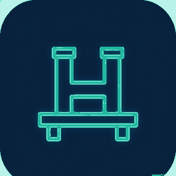

# HarnessDock 项目介绍

<div align="center">



**HarnessDock — 深潜工作台**

*DeepSeek Harness 的一键桌面停靠入口*

> 免责声明：本项目为独立的第三方客户端，与 DeepSeek 官方无隶属或背书关系；DeepSeek 及相关标识为 DeepSeek 官方商标。

</div>

---

## 1. 项目概述

### 1.1 HarnessDock 是什么

HarnessDock 是一个面向 DeepSeek Harness（下称 **dsh**）的**桌面薄壳客户端**。它的核心思路非常克制：不 fork 官方代码、不重写任何 Web 界面，而是拉起官方 `dsh web` 服务进程，并在原生桌面窗口（Electron）或编辑器面板（VS Code / Cursor）中**原样加载官方 Web UI**。

因此，官方 Web 端的全部能力——模型切换、工作区管理、会话、审批流、插件、导出——在 HarnessDock 中 **100% 原样可用**，且随官方版本升级自动获得新功能，只需要对齐一次版本号。

### 1.2 为什么叫 HarnessDock

**Dock** 一词三关：

- **码头 / 停靠台**：应用图标是霓虹青色线条绘制的 "H" 型码头桩，官方 Harness 如同一艘船，停靠进来即可使用；
- **任务栏 Dock**：像 macOS Dock 一样，是随手可及的一键入口；
- **Docking（对接）**：客户端与官方运行时精准"对接"，版本严格钉死、行为零偏差。

备选名（已弃用存档）：HarnessDeck、DSH Console、NovaShell。

### 1.3 解决什么问题

| 没有 HarnessDock | 有了 HarnessDock |
| --- | --- |
| 需要手动开终端、敲 `dsh web`、复制端口、开浏览器 | 双击图标，一键进入完整工作台 |
| 在不同电脑上需要预装 Node、全局安装 dsh | full 场景**完全离线可用**，单文件 Portable exe 免安装 |
| 浏览器标签页与日常工作流混杂 | 独立桌面窗口 + 系统托盘，Dock 常驻 |
| 版本漂移：文档、运行时、前端不一致 | `docs-sync` 将三者**钉在同一精确版本** |

---

## 2. 核心特性

### 2.1 薄壳零劫持

- 内嵌官方 Web UI，不做任何界面改写；
- 所有数据与凭证仍走官方 `~/.dsh/` 目录，不引入私有存储；
- 升级 = 对齐版本号，无维护包袱。

### 2.2 双场景交付

| 场景 | 体积 | 离线 | 首次启动 |
| --- | --- | --- | --- |
| **thin** | 小 | 需联网 | 经 `npx` 拉取钉版 dsh |
| **full** | 大 | ✅ 完全离线 | 开箱即用（内置 Node 22.19 + dsh 运行时） |

两种场景的 Windows 构建均产出**免安装单文件 Portable exe**。

### 2.3 裸机一键构建

构建脚本可在**任何第三方电脑**上直接运行，无需预装任何工具链：

1. 检测不到 Node（或版本低于 `^22.19.0`）→ 自动下载便携版 Node 22.19 到 `.rundata/toolchain/`，不污染系统环境；
2. 无 pnpm → 经 corepack 自动激活（失败回退 `npm install -g pnpm`）；
3. 无依赖 → 自动 `pnpm install --frozen-lockfile`；
4. 全程仅依赖系统自带的 `curl` 与解压工具。

### 2.4 三端同构

桌面端（Electron）与编辑器端（VS Code / Cursor 扩展）共用同一套运行时代码，Windows / macOS / Linux 跨平台支持。

---

## 3. 系统架构

```
┌─────────────┐    ┌────────────────┐    ┌──────────────────────┐    ┌─────────────────┐
│  docs-sync  │───▶│ client-runtime │───▶│ plugin-embedded-client│───▶│ Electron / VS Code │
│  钉精确版本  │    │ spawn dsh web  │    │     写 ready 文件      │    │  加载官方 URL     │
└─────────────┘    └────────────────┘    └──────────────────────┘    └─────────────────┘
```

详细说明：

1. **docs-sync**：从官方 git tag ∩ npm 交集解析出最新可用精确版本，产出 `origin.json` 与 `capability-matrix.yaml`，作为全仓唯一版本事实源；
2. **client-runtime**：以 `dsh web --host 127.0.0.1 --port 0 --no-open --patch` 拉起官方服务（随机端口、不自动开浏览器）；
3. **plugin-embedded-client**：握手完成后写入 ready 文件，通知宿主可以加载；
4. **宿主层**：Electron 主窗口或 VS Code WebView 加载官方 URL；启动时若检测到内置的 `resources/dsh-runtime`，自动切换 `DSH_RUNTIME=bundled`。

> 数据与凭证始终走官方 `~/.dsh/`，HarnessDock 不持有任何用户数据。

---

## 4. 快速开始

### 4.1 使用方（拿到安装包）

| 你拿到的是 | 怎么用 |
| --- | --- |
| `HarnessDock-Portable-*.exe` | 双击即用，无需安装 |
| `HarnessDock-Setup-*.exe` | 双击安装，可选安装目录 |
| `.dmg` / `.AppImage` / `.deb` | 按平台常规方式安装 |

### 4.2 开发者（从源码构建）

```bash
git clone <repo> && cd dsh_work

# 裸机一键构建（推荐，自动引导工具链）
scripts\build.bat win both        # Windows
./scripts/build.sh mac full       # macOS
./scripts/build.sh linux both     # Linux

# 或手动分步
pnpm install
pnpm test
pnpm --filter @dsh/desktop start  # 开发模式运行
```

产物输出在 `apps/desktop/release/thin` 与 `apps/desktop/release/full`。

---

## 5. 构建与打包矩阵

### 5.1 平台支持

| 平台 | 命令 | 产物 |
| --- | --- | --- |
| Windows | `pnpm pack:desktop:win[:full]` | NSIS 安装包 + Portable 单文件 exe + zip |
| macOS（仅 Mac 主机） | `pnpm pack:desktop:mac[:full]` | `.dmg` / `.zip`（x64 + arm64） |
| Linux（仅 Linux 主机） | `pnpm pack:desktop:linux[:full]` | `.AppImage` / `.deb` |
| 编辑器（三端通用） | `pnpm pack:vscode` | `.vsix` |

> macOS / Linux 产物必须在对应主机上构建；Windows 产物可在任意主机交叉构建。

### 5.2 一键脚本用法

```sh
# Windows
scripts\build.bat                    # 当前系统，thin
scripts\build.bat win full           # Windows 完整包
scripts\build.bat win both           # thin + full 一次全出
scripts\build.bat win full --skip-tests --skip-install   # 快速重建

# macOS / Linux
./scripts/build.sh                   # 当前系统，thin
./scripts/build.sh linux both --skip-tests
```

### 5.3 命名速查

顶层封装命令 → 实际动作：

| 命令 | 动作 |
| --- | --- |
| `pnpm setup` | 引导 pnpm + 安装依赖（裸机友好） |
| `pnpm build:desktop` | `node scripts/build.mjs` 跨平台一键构建 |
| `pnpm prepare:runtime` | 下载官方 node + `npm install dsh@精确版` 到 `runtimes/pack/` |
| `pnpm sync:dsh` | 对齐官方版本（`--pin x.y.z` 钉版 / `--check` CI 校验） |
| `pnpm parity` | 运行一致性测试 |

---

## 6. 配置参考

### 6.1 环境变量

| 变量 | 可选值 | 说明 |
| --- | --- | --- |
| `DSH_RUNTIME` | `local` / `download` / `bundled` | 运行时来源：本地开发 / 发行 npx 精确版 / 内置离线 |
| `DSH_RUNTIME_VERSION` | 精确版本号 | 覆盖 origin 中的版本；**禁止 `latest`** |
| `DSH_BIN` | 可执行文件路径 | 本地 dsh 二进制，优先级最高 |

### 6.2 版本对齐产物

| 文件 | 内容 |
| --- | --- |
| `packages/docs-sync/origin.json` | 钉定的官方精确版本 |
| `packages/docs-sync/capability-matrix.yaml` | 该版本的官方能力清单 |

---

## 7. 工程结构

```
dsh_work/
├── apps/
│   ├── desktop/          # Electron 薄壳（主进程 / preload / 打包配置 / 图标）
│   └── vscode/           # VS Code / Cursor 扩展
├── packages/
│   ├── docs-sync/        # 版本钉定与能力矩阵
│   ├── client-runtime/   # spawn dsh web 的运行时封装
│   └── plugin-embedded-client/  # 握手与 ready 文件
├── scripts/
│   ├── build.bat/.sh     # 裸机一键构建入口（自动下载便携 Node）
│   ├── build.mjs         # 跨平台构建编排（os × scenario 矩阵）
│   ├── bootstrap.mjs     # pnpm / 依赖引导
│   └── node-version-check.cjs  # Node 版本门
├── runtimes/             # full 场景内置运行时（构建期生成）
├── docs/images/          # 项目文档配图
└── tests/                # 单元与一致性测试（vitest）
```

---

## 8. 常见问题（FAQ）

**Q: HarnessDock 会收集我的数据吗？**
不会。数据与凭证全部走官方 `~/.dsh/`，客户端不含任何遥测。

**Q: 官方 dsh 升级后需要改代码吗？**
只需 `pnpm sync:dsh` 对齐新版本号并验证能力矩阵，不涉及界面适配。

**Q: 在没有网络的电脑上能用吗？**
可以。使用 **full** 场景产物（`HarnessDock-Portable-*-full.exe` 或对应安装包），运行时完全内置。

**Q: 为什么 macOS 包不能在 Windows 上打？**
electron-builder 的 macOS 签名与打包依赖 macOS 系统组件；跨平台发布请使用 GitHub Actions release workflow 中对应平台的 runner。

**Q: 如何验证本地环境满足构建要求？**
直接运行一键脚本即可——它会自己检查并补齐 Node / pnpm / 依赖。

---

## 9. 设计原则

1. **不做中间人**：不代理、不改写、不缓存官方 UI 与数据；
2. **版本即契约**：文档、运行时、前端 SPA 三者钉同一精确版本，禁止 `latest`；
3. **开箱即用**：使用方零依赖，构建方零预装；
4. **可回溯**：每个产物的版本、能力清单、来源都可由 `origin.json` 追溯。

---

<div align="center">

*HarnessDock — 让官方 Harness 随手停靠。*

</div>
