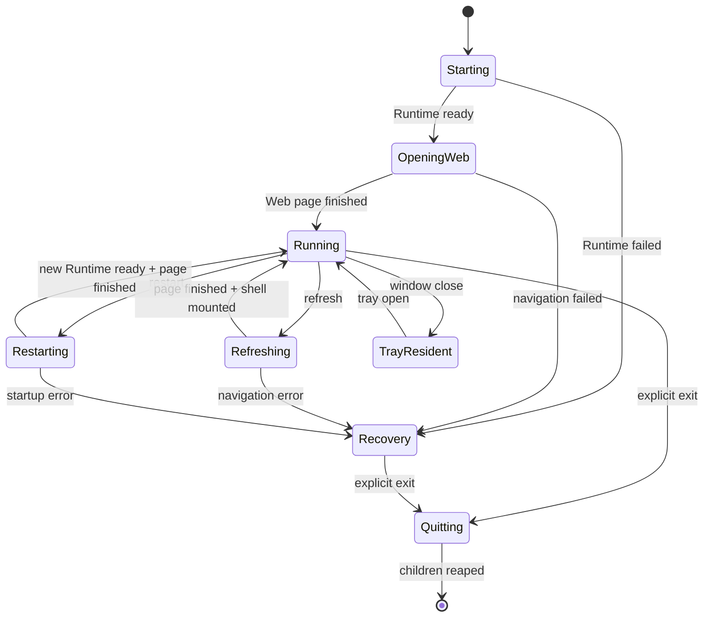

# HarnessDock v0.2.6 外壳、Web 恢复与退出机制修复方案

## 1. 目标与发布原则

本方案解决以下发布阻断问题：

1. 桌面端启动后必须直接进入 Harness Web，初始化阶段不得创建或显示设置窗口。
2. 设置窗口只能由用户主动点击顶部按钮、托盘菜单或应用菜单打开，并且必须是可见、可交互的完整页面。
3. Harness 顶部的“刷新 Web”和“重启 Web”不能把 WebView 留在白屏、无标题栏或不可操作状态。
4. 设置页、托盘退出和其他退出入口必须统一收口，退出后不遗留 Runtime、Gateway、Node worker 或启动中的子进程。
5. 上述问题必须在合并和发布前由契约测试、Rust 跨平台编译、候选包构建和人工验收共同确认；“能打包”不能替代“能操作”。

版本策略：代码先在独立分支完成，所有检查通过后合并到 `main`，再用同一 `main` SHA 重新生成并替换 v0.2.6 发布资产。不得在验证失败时直接覆盖正式资产。

## 2. 已确认的根因

### 2.1 启动表面混杂

原来的 `main` 页面同时承担启动页、Runtime 管理页、Gateway 管理页和设置入口。即使 Runtime 最终能打开 Web，用户在启动瞬间仍会看到类似设置页的控制页面，造成“默认打开设置”的体验。

修复后的职责：

- `main`：仅作为启动/故障恢复入口。正常启动时自动启动 Runtime，成功后立即隐藏。
- `harness`：唯一的主工作窗口，承载官方 Harness Web 和外壳标题栏。
- `settings`：按需创建的单例设置插件窗口，不参与启动。

### 2.2 设置窗口在同步调用中创建

设置窗口由远程 Harness Web 的点击事件触发，而旧实现把 `WebviewWindowBuilder::new(...).build()` 放在同步命令路径中。Windows WebView2 对同步命令/事件处理器内创建窗口存在死锁风险，也会表现为窗口打开后白板或点击无响应。

修复为异步命令，并增加 `settings_opening` 并发保护：

- 已存在窗口：`show + focus`；
- 正在创建：拒绝重复创建并给出可见提示；
- 首次创建：隐藏构造、完成后显示；
- 设置窗口关闭：隐藏而不是销毁；
- 进程退出：由统一退出协调器接管。

### 2.3 刷新/重启丢失注入脚本

旧的刷新使用 `window.location.reload()`，重启则复用旧 WebView 并直接导航。文档重新加载后，`initialization_script` 不会自动再次安装，导致外壳按钮消失；Runtime 切换期间又可能把 WebView 显示在未就绪地址上，形成白屏。

修复为统一的 `WebSurfaceController` 行为（当前实现集中在 `harness_window.rs`）：

- 刷新：只读取当前健康 Runtime 地址，使用 Tauri 原生 `navigate`，不停止 Runtime/Gateway；
- 重启：先锁定 Web 操作、隐藏旧 WebView、停止 Gateway、停止 Runtime、启动新 Runtime，再导航并显示；
- WebView 每次页面完成加载时重新执行外壳初始化脚本；
- 刷新和重启共享互斥状态，防止重复点击造成交叉导航；
- Runtime 地址只允许 loopback HTTP(S)，不会导航到外部地址；
- 失败时显示 `main` 恢复页和具体错误，不把失败伪装成空白 WebView。

### 2.4 远程 Harness IPC capability 不完整

Harness 是 loopback 外部 URL，不属于 Tauri bundled local URL。它需要单独的远程 capability 才能调用受限的外壳命令。 capability 必须同时满足：

- 只匹配 `harness` 窗口；
- `local: false`，不把这组权限授予 bundled local 页面；
- 只匹配 loopback HTTP(S) 的任意端口；
- 只包含设置、窗口控制、刷新和重启命令；
- 不授予 Runtime 文件、Gateway 管理或退出以外的额外权限。

设置页仍使用单独的 local capability，不能通过远程页面继承。

### 2.5 退出在清理完成前立即结束主进程

旧退出逻辑先发送停止操作，随后立即 `app.exit(0)`。Runtime/Gateway 启动使用 blocking task，子进程可能已经创建但尚未写入状态表；此时立即退出会留下 Node 子孙进程、Gateway 或临时目录。

修复为 `LifecycleCoordinator` 行为（当前实现集中在 `lib.rs` 和 `process.rs`）：

1. 原子设置 `quitting`，重复退出请求直接幂等返回。
2. 拒绝新的 Runtime、Gateway、Web 和设置操作。
3. 循环停止“启动中但未登记”的 PID。
4. 停止已登记的 Gateway 和 Runtime，回收整个进程树/进程组。
5. 等待启动注册表清空；最后再做一次幂等清理。
6. 清理完成后调用 `app.exit(0)`。
7. 窗口关闭事件默认隐藏到托盘；设置页、Harness、主恢复页行为一致；只有托盘/设置中的“退出 HarnessDock”是真正退出。

## 3. 目标状态机

关键不变量：

- `settings` 不在 `Starting` 状态中创建；
- `Running` 状态必须同时满足 Runtime 存活、Web URL 是 loopback、WebView 已完成加载；
- `Refreshing` 不停止 Runtime；
- `Restarting` 不允许 Gateway 继续指向旧 Runtime；
- `Quitting` 后任何新启动和重启都必须被拒绝；
- 只有 `Quitting` 清理完成后才允许主进程退出。

## 4. 代码改造清单

### 外壳与 WebView

- `apps/tauri/src-tauri/src/harness_window.rs`
  - `shell_settings_show` 改为异步命令；
  - 增加设置创建互斥；
  - `harness_reload_web` 改为原生导航；
  - `harness_restart_web` 与刷新共享 Web 操作互斥；
  - `on_page_load(Finished)` 重新挂载标题栏；
  - 失败回退 `main` 恢复页。
- `apps/tauri/src-tauri/src/harness_shell.rs`
  - 标题栏按钮区域禁止拖动；
  - 使用动态上下安全内边距；
  - 页面宽度不足时按钮可滚动，不遮挡 Harness 内容；
  - 所有失败显示 toast，不静默吞错。
- `apps/tauri/src-tauri/capabilities/harness-shell.json`
  - 只允许 loopback remote URL；
  - 保持远程权限最小化。

### 启动页与设置页

- `apps/tauri/web/index.html`：移除默认可见的设置卡片，保留启动状态和故障恢复入口。
- `apps/tauri/web/app.js`：启动成功后只打开 Harness Web；只有失败时显示 Runtime/Gateway 恢复卡片。
- `apps/tauri/web/settings.html`：保留完整可见内容、Runtime 恢复、更新、退出功能。
- `apps/tauri/web/settings.js`：每次调用动态读取 Tauri IPC，避免脚本初始化时机造成按钮失效。

### 退出与子进程

- `apps/tauri/src-tauri/src/lib.rs`：统一退出入口，异步等待清理完成后退出。
- `apps/tauri/src-tauri/src/process.rs`：维护启动中 PID 注册表，跨平台回收进程树，并提供清空检测。
- `apps/tauri/src-tauri/src/tray.rs`：设置、更新、重启均通过异步入口；退出只调用统一协调器。
- `runtime.rs` / `gateway_host.rs`：保持停止操作幂等；重启先停 Gateway 再换 Runtime。

## 5. 发布前验收矩阵

| 场景 | 预期结果 | 自动门禁 | 人工验收 |
|---|---|---|---|
| 首次启动 | 直接进入 Harness Web；设置窗口不存在 | 启动契约测试 | Windows/macOS/Linux |
| Runtime 慢启动 | 仅显示启动状态，不显示设置页；成功后打开 Web | Runtime smoke | 三端冷启动 |
| 点击设置 | 设置窗口可见、有标题、有内容，重复点击复用同一窗口 | 异步创建/按需契约 | 三端点击 |
| 刷新 Web | Web 内容恢复，标题栏仍在，Runtime PID 不变 | 禁止 `window.location.reload()` + page-load 契约 | 三端点击 |
| 重启 Web | 新 Runtime PID，Gateway 不指向旧地址，Web 非空白 | Runtime/Gateway 顺序测试 | 三端点击 |
| ACL | 顶部设置/刷新/重启无 ACL 错误 | capability JSON + Tauri manifest build | 已安装包点击 |
| 页面布局 | Web 顶部、底部内容不被标题栏遮挡 | shell layout 契约 | 窄窗口/高 DPI |
| 关闭窗口 | 隐藏到托盘，后台 Runtime 仍按策略运行 | WindowEvent 契约 | 三端点击 X |
| 明确退出 | Runtime、Gateway、Node worker 全部结束，无临时目录残留 | process/lifecycle tests | 进程列表复核 |
| 启动中退出 | 不遗留刚创建的子进程 | starting registry gate | 启动后立即退出 |
| 更新失败 | 当前版本继续可用，不自动退出或覆盖 | release workflow gate | 断网检查 |
| 发布一致性 | candidate、CI、Release 使用同一 main SHA | release same-SHA gate | Release asset 核对 |

## 6. 必须执行的检查顺序

1. `node --check apps/tauri/web/app.js`
2. `node --check apps/tauri/web/settings.js`
3. `pnpm vitest run ... tests/parity/tauri-host.test.ts`
4. `cargo fmt --check`、三平台 `cargo check`、Tauri manifest/capability 构建
5. Android/iOS smoke，确认移动端不创建桌面 Harness 窗口
6. Full-only candidate：Runtime、桌面安装包、Android APK/AAB、iOS 包全部生成
7. 候选门禁确认所有资产齐全、尺寸/资源/版本校验通过
8. 使用同一提交 SHA 生成 Release，核验资产数量和 `SHA256SUMS`
9. 安装包人工验收：启动、设置、刷新、重启、关闭、托盘退出、进程列表

任何一步失败都必须回到分支修复并重新执行，不允许通过跳过测试或手工覆盖资产放行。

## 7. 后续增强（不阻塞本次修复）

- 接入 Tauri updater 签名、公钥和更新服务器后，再启用静默下载安装；
- 增加基于 Tauri WebDriver/系统 WebView 的真实点击 smoke，覆盖 ACL、设置窗口和刷新/重启后的非空白断言；
- 将启动、页面加载、进程回收和退出原因写入滚动日志，支持从设置页导出诊断包；
- 保存窗口尺寸、最大化状态和最后一次 Web 路由，但不保存或修改用户 `.dsh` 配置；
- 在 Linux Wayland、Windows WebView2 缺失和 macOS 高 DPI 环境增加真实安装测试。

