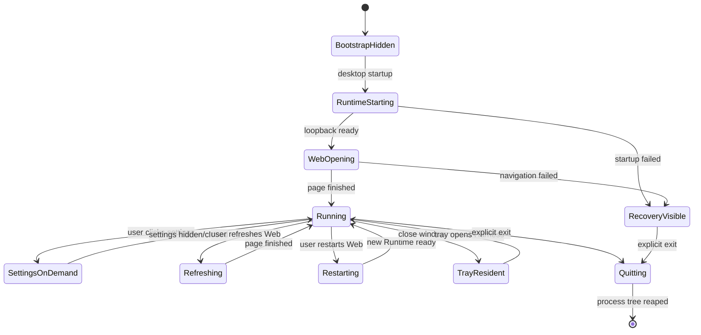

# HarnessDock v0.2.7 直接进入 Harness Web 与生命周期加固方案

## 1. 发布目标

v0.2.7 不再把“启动控制页”当成用户入口。桌面端启动后的唯一正常用户表面是官方 Harness Web；外壳设置属于宿主插件，只能在用户点击顶部“设置”、托盘或应用菜单后打开。

本版本同时收口四条容易回归的边界：

1. 启动不能先显示虚拟设置/恢复页。
2. 设置插件首次打开必须有内容、可交互、可复用，不能白板。
3. 刷新、重启、窗口控制必须保持 Web 内容可见，失败必须给出可见恢复入口。
4. 关闭窗口、托盘退出、启动中退出都必须遵守统一的进程清理协议。

## 2. v0.2.6 遗留根因

### 2.1 桌面主窗口仍然可见

`tauri.conf.json` 中桌面 `main` 窗口仍为 `visible: true`。`main` 页面虽然已经删除了设置卡片，但仍包含 Runtime、Gateway、外壳设置按钮，因此用户会先看到一个类似虚拟设置的控制界面。

这不是文案问题，而是窗口可见性和职责划分错误。v0.2.7 将：

- 桌面基础配置设为 `visible: false`；
- Android/iOS 的覆盖配置继续保持 `visible: true`，因为移动端主 WebView 承载 Remote Gateway 入口；
- 启动脚本再次调用 `control_hide`，覆盖旧版本升级、窗口状态复用和未来配置误改造成的闪现。

### 2.2 恢复页承担了过多启动职责

`main` 仍然必须加载本地 JavaScript 来启动 Runtime，所以它不能被删除；但它不应该成为用户看到的窗口。v0.2.7 把它明确定位为：

```text
隐藏 main = bootstrap / recovery surface
可见 harness = 正常工作 surface
按需 settings = 宿主维护 plugin
```

正常路径中 `main` 只在后台执行启动协调，Runtime 返回 loopback 地址后创建 `harness` WebView，页面触发 `Finished` 后才显示 `harness`。任何异常才调用 `control_show` 显示恢复页。

### 2.3 远程 capability 的 URL pattern 不完整

外部 Harness WebView 需要远程 capability 才能使用有限的 Tauri IPC。仅匹配 origin 或不匹配路径，会导致某些 Runtime URL、重定向路径或 IPv6 loopback 环境出现 `Command ... not allowed by ACL`。

v0.2.7 的 `harness-shell` capability：

- `local: false`，不把远程命令权限授予本地控制页；
- `windows: ["harness"]`，只作用于 Harness WebView；
- `platforms: ["linux", "macOS", "windows"]`，不污染移动端能力边界；
- 使用 `http(s)://127.0.0.1:*/**` 与 `localhost` 的完整路径 pattern；Runtime 发布配置固定绑定 IPv4 loopback，避免 Tauri 2.11 URLPattern 对方括号 IPv6 主机语法解析失败；
- 只保留设置、窗口控制、刷新和重启命令。

同时从 `local-main` 移除重复的 `harness-shell` 权限，避免维护两套含义相同但边界不同的授权。

## 3. 目标启动状态机



关键不变量：

- `settings` 不在 `BootstrapHidden`、`RuntimeStarting` 或 `WebOpening` 中创建；
- 正常桌面启动不显示 `main`；
- `Running` 必须满足 Runtime 存活、URL 是 loopback、Harness 页面加载完成；
- Web 刷新不停止 Runtime；
- Web 重启先停止 Gateway，再停止 Runtime，再启动新 Runtime；
- `Quitting` 后拒绝新的启动、刷新、重启和设置创建。

## 4. 实现改造

### 4.1 Tauri 窗口配置

- 桌面 `tauri.conf.json` 的 `main.visible=false`；
- 移动覆盖文件的 `main.visible=true`；
- `harness` 动态窗口继续 `visible=false` 创建，只有 `PageLoadEvent::Finished` 后 `show + focus`；
- `settings` 不预创建，不参与 `setup`，首次命令调用时异步创建并在完成后显示。

### 4.2 启动协调

`app.js` 在桌面本地 Runtime 分支中先调用 `control_hide`，再调用 `runtime_start` 和 `harness_open`。这样即使用户从旧版本升级、旧窗口状态被保留或配置发生回退，也不会把恢复控制页当作首屏。

失败路径必须执行：

1. 清除启动并发状态；
2. 显示具体错误；
3. 显示 Runtime/Gateway 恢复卡片；
4. 显示 `main` 恢复页；
5. 保留设置、重试、停止和退出能力。

### 4.3 设置插件

`shell_settings_show` 保持异步：

- 已存在窗口：`show + focus`；
- 首次点击：隐藏构建、完成后显示；
- `PageLoadEvent::Finished` 前始终保持隐藏，禁止白板 WebView 抢先出现在桌面；
- 重复点击：由 `settings_opening` 拒绝并返回明确状态；
- 关闭：隐藏而非销毁；
- 设置页面自身显示完整 HTML 内容，并允许查看 Runtime、更新和退出。

### 4.4 刷新和重启

- 刷新使用 Tauri 原生 `navigate`，不调用页面侧 `window.location.reload()`；
- 刷新和重启共享 `web_action` 互斥；
- 页面加载完成后重新注入外壳标题栏；
- 标题栏通过顶部/底部 inset 和受控内容区高度参与布局，避免固定高度的 Harness 页面覆盖首尾内容；
- WebView 导航期间隐藏，避免展示白板；
- 导航失败恢复原窗口或显示 `main` 恢复页；
- 重启前关闭 Gateway，避免旧 Gateway 指向已停止 Runtime。

### 4.5 退出机制

退出由 `request_exit` 统一处理：

1. 原子设置 `quitting`，重复退出幂等返回；
2. 停止接受新的启动和窗口操作；
3. 回收启动中尚未登记的 PID；
4. 停止 Gateway 和 Runtime 的整个进程树；
5. 等待启动注册表清空并执行最后一次幂等清理；
6. 最后才调用 `app.exit(0)`。

窗口关闭默认隐藏到托盘。只有托盘、菜单或设置页的显式“退出 HarnessDock”才是真正退出。

## 5. 发布前门禁

### 自动检查

- `node --check apps/tauri/web/app.js`
- `node --check apps/tauri/web/settings.js`
- `pnpm check:versions`
- `pnpm check:release`
- Tauri parity：桌面 `main.visible=false`、移动端 `visible=true`、capability URL pattern、权限边界、设置按需和 `control_hide` 契约；
- Rust `cargo fmt --check` 与 Linux/macOS/Windows `cargo check`；
- Android/iOS 初始化与 smoke 构建；
- Full-only Runtime、桌面安装包、Android APK/AAB、iOS 包；
- candidate gate 与 main CI 必须使用相同提交 SHA；
- Release 资产必须包含全部平台包和 `SHA256SUMS`。

### 人工验收

| 场景 | 预期结果 |
| --- | --- |
| 桌面冷启动 | 首个可见窗口是 Harness Web，不出现虚拟设置页 |
| Runtime 慢启动 | 不显示控制页；Harness 就绪后再显示 Web |
| 点击设置 | 设置窗口首次打开即有完整内容，重复点击复用 |
| 刷新 Web | 页面恢复、标题栏仍在、Runtime PID 不变 |
| 重启 Web | 新 Runtime PID，Gateway 不连接旧 Runtime，页面非白板 |
| 顶部按钮 | 设置/刷新/重启/最小化/最大化/关闭均有结果反馈 |
| 关闭窗口 | 隐藏到托盘，进程按策略继续运行 |
| 托盘退出 | Runtime、Gateway、Node 子孙进程全部结束 |
| 启动中退出 | 不遗留刚创建但尚未登记的子进程 |
| 高 DPI/窄窗口 | Web 顶部和底部内容不被外壳遮挡 |

## 6. 不允许的发布行为

- 不得把 `main.visible=true` 当作“启动反馈”；
- 不得在 setup 中预创建 settings；
- 不得用页面 `window.location.reload()` 代替受控原生导航；
- 不得用跳过 Tauri 编译或只构建 debug APK 代替发布验证；
- 不得在候选失败时手工覆盖正式 Release 资产；
- 不得将远程 Harness capability 扩展为 Runtime 文件、Gateway 或任意 shell 权限。

## 7. 后续增强

本版本之后可以继续增加真实安装包 GUI E2E：在 Windows WebView2、macOS WebKit、Linux WebKitGTK 上启动发布安装包，自动验证首屏窗口、设置 DOM、ACL 按钮调用、刷新/重启非白屏和退出后进程列表。这类测试用于防止以后只通过源码契约而遗漏真实桌面交互。
