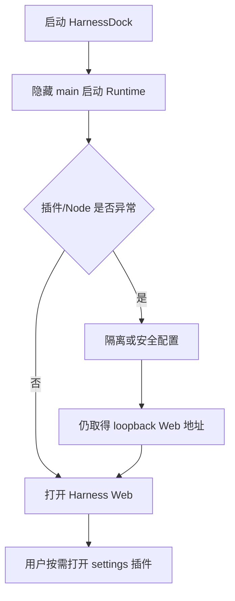

# HarnessDock Shell Settings Plugin

## 目标

Harness Web 是桌面端唯一的主工作界面，启动成功后必须直接打开，用户不需要先看到任何配置页。外壳设置是宿主级按需插件，只在用户主动点击入口时出现。

完整策略是：

- `main` 仅作为隐藏启动控制面，负责 Runtime 启动、恢复与状态；
- `harness` 是用户实际使用的官方 Harness Web 主窗口；
- `settings` 是独立的本地外壳设置插件窗口，首次点击时创建，之后复用；
- 插件错误只能触发隔离/兼容/安全配置，不能阻止已有 Web 地址交给主窗口；
- 系统 Node 不能启动时自动回退到随包 Node，不安装系统环境、不修改用户 PATH。

## 窗口职责

| 窗口 | 默认状态 | 职责 |
| --- | --- | --- |
| `main` | 隐藏 | 启动 Runtime、执行恢复、承载异常诊断 |
| `harness` | Runtime ready 后显示 | 官方 Harness Web 主工作界面 |
| `settings` | 不创建 | 顶部按钮或应用菜单点击后才创建/显示独立设置插件 |

## 启动契约

正常路径和降级路径最终都以 `harness_open` 为出口；只有 Runtime 本身无法提供 loopback Web 地址时才显示诊断控制面。

## 设置插件功能

设置插件提供四类操作：

- 查看 Runtime 状态、版本、Node 来源、兼容模式和隔离插件；
- 一键重新打开 Harness Web；
- 重启 Runtime 并打开 Web；
- 清除持久化插件隔离后重启，或显式停止 Runtime。

设置插件关闭后不会停止 Runtime，也不会关闭 Harness Web。它不承载正常工作流，用户可以始终停留在 Harness Web。

## 安全边界

`harness` 只允许 loopback Runtime URL，注入脚本也会再次检查 loopback host。远程 Harness/Gateway 页面不会获得本地 Tauri IPC 权限。

- `harness-shell` capability（窗口 `harness`）只允许按需打开设置、窗口控制和 Web 恢复命令；
- `shell-settings` capability（窗口 `settings`）只允许读取/恢复宿主自有 Runtime；
- `local-main` capability（窗口 `main`）负责启动控制和 Gateway；
- 设置插件不能读取插件配置、执行任意命令或把远程页面升级为宿主权限。

## 验收标准

1. 桌面正常启动默认直接进入 Harness Web，配置窗口不抢占首屏。
2. 旧配置中的自动打开开关不再影响启动；启动契约固定为 Web 优先。
3. 第三方插件异常时，仍优先尝试隔离恢复，再使用临时干净配置，最终仍打开 Web。
4. 系统 Node 启动失败时，自动尝试随包 Node。
5. Harness 顶部按钮与应用菜单均打开同一个独立 settings 插件窗口。
6. 设置插件可查看状态、重新打开、重启 Runtime、清除隔离并停止 Runtime。
7. 所有高权限命令按窗口 capability 隔离，Windows 子进程不显示控制台窗口。
