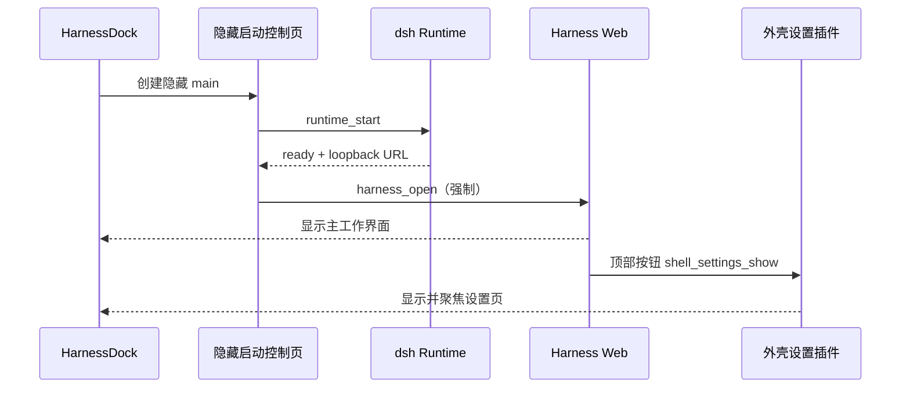

# HarnessDock Shell Settings Plugin

## 目标

Harness Web 是桌面端唯一的主工作界面。启动成功后必须直接显示 Harness Web，外壳设置不参与启动竞争，也不因为启动成功而自动弹出。

外壳设置作为一个宿主级插件存在：

- Harness Web 顶部提供唯一的“外壳设置”入口；
- 点击入口后显示已加载的本地外壳设置窗口；
- 应用菜单保留“HarnessDock → 外壳设置”作为备用入口；
- Runtime、插件兼容恢复和 Node 选择仍由隐藏的启动控制页负责；
- 设置插件只获得显示设置窗口的最小 IPC 权限。

## 窗口职责

| 窗口 | 默认状态 | 职责 |
| --- | --- | --- |
| `main` | 隐藏 | 启动 Runtime、处理恢复失败、承载 Shell Settings Plugin |
| `harness` | Runtime ready 后显示 | 用户实际使用的官方 Harness Web |
| `settings` | 不单独创建 | 复用 `main` 的控制页，以弹出窗口形式按需显示 |

复用隐藏控制页可以避免重复启动 Runtime、重复创建 WebView 数据目录和重复加载插件配置。设置插件打开时只改变 `main` 的可见性与焦点，不改变 Harness Web 的生命周期。

## 启动与交互生命周期

## 安全边界

`harness` 窗口只允许 loopback Runtime URL。注入脚本再次检查 `localhost/127.0.0.1/::1`，非 loopback 页面不会安装按钮。

`harness-shell` capability 只允许 `shell_settings_show`。它不能启动/停止 Runtime、管理 Gateway、读取插件配置或写入 DSH 配置。所有高权限操作仍留在 `local-main` capability。

## 失败与恢复

- 正常启动：Runtime ready 后打开 Harness Web，设置窗口保持关闭。
- Runtime/插件启动失败：显示原有控制页，提供恢复和重试能力。
- 用户打开设置：显示控制页，Harness Web 不被关闭。
- 用户关闭设置：仅隐藏控制页，Harness Web 仍保持可用。
- 用户停止 Runtime：沿用现有显式停止流程，关闭 Harness Web 并显示控制页。

## 验收标准

1. 首次启动不会显示外壳设置页，直接进入 Harness Web。
2. 已保存的旧 `autoOpenHarness=false` 不再阻断 Web 启动；启动行为始终为自动打开。
3. Harness Web 顶部存在“外壳设置”按钮，点击一次显示设置页，再次点击只复用同一窗口。
4. 应用菜单入口与顶部入口行为一致。
5. 插件报错不会阻断 Harness Web；启动失败时控制页仍可用。
6. Windows/macOS/Linux 的 Tauri 构建、Rust 检查和现有 Runtime smoke 全部通过。
