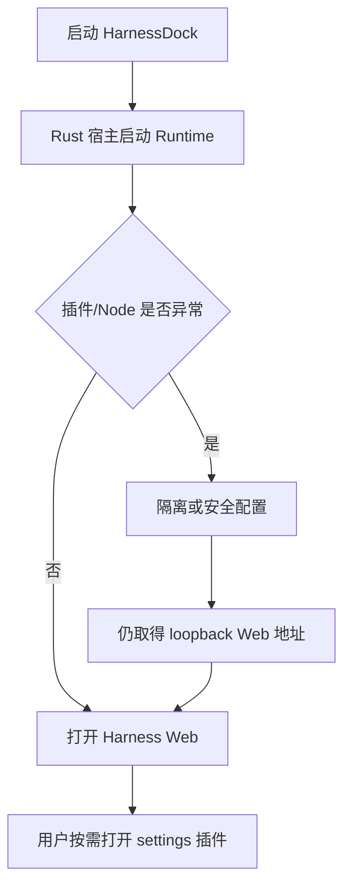

# HarnessDock Plugin Diagnostics

## 目标

Harness Web 是桌面端唯一的主工作界面，启动成功后必须直接打开，用户不需要先看到任何配置页。插件诊断是宿主级按需窗口，只在用户主动点击入口时出现。

完整策略是：

- `main` 仅作为隐藏 Bootstrap/恢复面，负责失败后的重试与状态；正常 Runtime 启动由 Rust 宿主协调器负责；
- `harness` 是用户实际使用的官方 Harness Web 主窗口；
- `splash` 是启动、刷新和重启期间的本地进度窗口；
- `settings` 是独立的本地插件诊断窗口，首次点击时创建，之后复用；
- 插件错误只能触发隔离/兼容/安全配置，不能阻止已有 Web 地址交给主窗口；
- 系统 Node 不能启动时自动回退到随包 Node，不安装系统环境、不修改用户 PATH。

## 窗口职责

| 窗口 | 默认状态 | 职责 |
| --- | --- | --- |
| `main` | 隐藏 | 承载失败后的恢复、重试和异常诊断；正常 Runtime 启动由 Rust 宿主执行 |
| `harness` | Runtime ready 后显示 | 官方 Harness Web 主工作界面 |
| `splash` | 启动和恢复期间显示 | 展示初始化、Runtime、Web 导航状态 |
| `settings` | 不创建 | “菜单”、托盘或应用菜单点击“插件诊断”后才创建/显示 |

## 启动契约

正常路径和降级路径最终都以 `harness_open` 为出口；Harness Web 完成绘制前保持隐藏，20 秒未完成加载或 Runtime 无法提供 loopback Web 地址时才显示诊断恢复面。启动失败不会触发宿主退出。

## 设置插件功能

插件诊断只负责查看和收口，不重复承载主界面动作：

- 查看 Runtime 状态、版本、Node 来源、兼容模式和隔离插件；
- 手动刷新诊断数据；
- 查看自动更新策略和签名配置状态；
- 退出诊断窗口或执行完整退出。

刷新 Web、重启 Runtime、清除插件隔离并重启、自动更新统一放在 Harness 主界面的“菜单”中，避免用户在两个窗口之间寻找同一功能。

设置插件关闭后不会停止 Runtime，也不会关闭 Harness Web。它不承载正常工作流，用户可以始终停留在 Harness Web。

## 安全边界

`harness` 只允许 loopback Runtime URL，注入脚本也会再次检查 loopback host。远程 Harness/Gateway 页面不会获得本地 Tauri IPC 权限。

- `harness-shell` capability（窗口 `harness`）允许按需打开插件诊断、窗口控制、Web 恢复和自动更新命令；loopback URL 同时覆盖根路径和 `/*` 子路径 pattern；
- `shell-settings` capability（窗口 `settings`）只允许读取宿主自有 Runtime、刷新诊断数据和退出客户端，不允许重复执行 Web/Runtime/更新动作；
- `local-main` capability（窗口 `main`）负责失败后的启动恢复和 Gateway；正常桌面启动由 Rust `startup` 协调器执行；
- 设置插件不能读取插件配置、执行任意命令或把远程页面升级为宿主权限。

## 验收标准

1. 桌面正常启动默认直接进入 Harness Web，配置窗口不抢占首屏。
2. 旧配置中的自动打开开关不再影响启动；启动契约固定为 Web 优先。
3. 第三方插件异常时，仍优先尝试隔离恢复，再使用临时干净配置，最终仍打开 Web。
4. 系统 Node 启动失败时，自动尝试随包 Node。
5. Harness 顶部只保留一个“菜单”按钮；刷新、重启 Runtime、清除插件隔离并重启、插件诊断和自动更新均从这里进入。
6. 刷新、重启和插件恢复在当前 Web 窗口直接执行，执行期间显示动画和文字状态；只有明确点击“插件诊断”才打开独立诊断窗口。
7. 插件诊断可查看状态、刷新诊断数据和执行完整退出，不重复提供 Web/Runtime/更新按钮。
8. 所有高权限命令按窗口 capability 隔离，Windows 子进程不显示控制台窗口。
9. WebView 切换期间即使所有窗口短暂隐藏，Tauri 也不会自动退出；只有显式退出协调器可以结束宿主。

自动更新使用独立的 `update_install` 宿主命令，先比较 GitHub 最新稳定 Release。它只接受构建时注入的发布公钥和固定的官方 `latest.json` 地址，下载完成后先由 Tauri updater 校验签名，再交给统一退出流程重启客户端。没有配置公钥、签名资产或更新清单时，命令会返回可见错误并保留发布页手动更新入口，不会下载或替换未知安装包。
